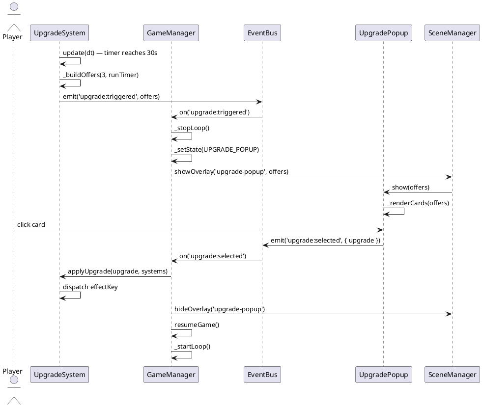
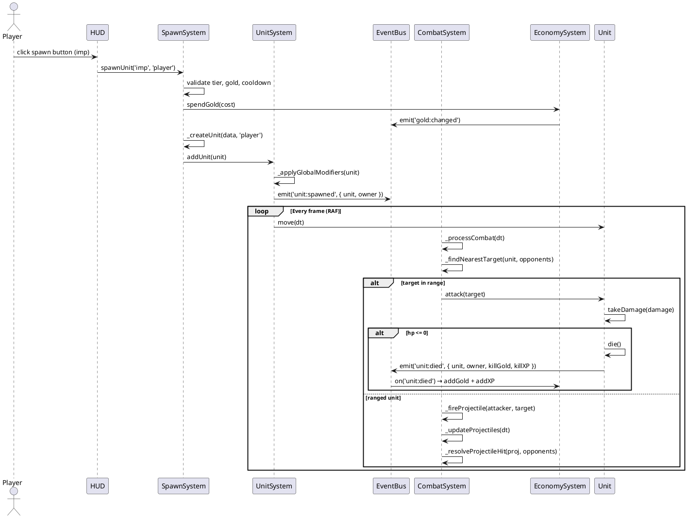

# Warlords: Last Siege — UML Class Diagram (Text Representation)

> This file describes the class diagram in PlantUML notation.
> Import into draw.io or render at https://www.plantuml.com/plantuml/

```plantuml
@startuml WarlordClassDiagram

' ── Core ──────────────────────────────────────────────────────────────────

class GameManager {
  -_gameData: object
  -_state: GAME_STATE
  -_heroId: string
  -_difficulty: string
  -_runTimer: number
  -_runStats: object
  +saveManager: SaveManager
  +sceneManager: SceneManager
  +audioManager: AudioManager
  +economySystem: EconomySystem
  +tierSystem: TierSystem
  +spawnSystem: SpawnSystem
  +combatSystem: CombatSystem
  +unitSystem: UnitSystem
  +upgradeSystem: UpgradeSystem
  +aiSystem: AISystem
  +renderer: Renderer
  +playerBase: Base
  +enemyBase: Base
  +hud: HUD
  +init()
  +startRun(heroId, difficulty)
  +pauseGame()
  +resumeGame()
  +endRun(result)
  +resetRun()
  +resumeRun()
  -_update(dt)
  -_startLoop()
  -_stopLoop()
  -_buildSaveState()
  -_setupTestAPI()
}

class EventBus <<singleton>> {
  -_listeners: Map<string, Set<Function>>
  -_debug: boolean
  +on(event, callback): Function
  +off(event, callback)
  +once(event, callback): Function
  +emit(event, data)
  +clear(event?)
  +setDebug(enabled)
}

class SceneManager {
  -_screens: Map<string, object>
  -_currentScene: string
  -_previousScene: string
  +register(name, controller)
  +switchTo(sceneName, data)
  +showOverlay(sceneName, data)
  +hideOverlay(sceneName)
  +goBack(data)
  +getCurrentScene(): string
}

class SaveManager {
  -_lastSave: object
  -_autoSaveInterval: number
  -_stateProvider: Function
  +save(state): boolean
  +load(): object
  +hasSave(): boolean
  +clear()
  +startAutoSave()
  +stopAutoSave()
  +setStateProvider(fn)
  +{static} buildSaveState(params): object
}

' ── Entities ──────────────────────────────────────────────────────────────

class Unit {
  +uid: number
  +id: string
  +name: string
  +tier: number
  +type: string
  +owner: string
  +hp: number
  +maxHp: number
  +damage: number
  +speed: number
  +attackSpeed: number
  +range: number
  +cost: number
  +state: UNIT_STATE
  +statusEffects: array
  +appliedUpgrades: array
  +isElite: boolean
  +isPiercing: boolean
  +move(dt)
  +attack(target): number
  +takeDamage(amount, source)
  +heal(amount)
  +die()
  +revive(hpPercent)
  +applyStatusEffect(effect)
  +addUpgradeHook(hook)
  +applyDamageMultiplier(m)
  +applyHpMultiplier(m)
  +applySpeedMultiplier(m)
  +applyAttackSpeedMultiplier(m)
  +canAttack(): boolean
  +isInRange(target): boolean
  +getHpPercent(): number
  +serialize(): object
}

class Hero {
  +id: string
  +name: string
  +playstyle: string[]
  +startingGold: number
  +tierUnlockCostModifier: number
  +uniqueUpgradePool: string[]
  +passiveEffects: object
  +applyPassive(systems)
  +updatePassive(dt, systems)
  +getAvailableUnitIds(maxTier): string[]
  +cleanup()
  +{static} create(data): Hero
}

class DemonQueen extends Hero {
  -_recentSpawnTimes: number[]
  -_swarmBuffActive: boolean
  +applyPassive(systems)
  +updatePassive(dt, systems)
  -_activateSwarmBuff()
}

class NecroKing extends Hero {
  -_deathCount: number
  -_lastDeadUnit: Unit
  +applyPassive(systems)
}

class HumanCommander extends Hero {
  +applyPassive(systems)
}

class Base {
  +owner: string
  +hp: number
  +maxHp: number
  +position: {x, y}
  +width: number
  +height: number
  +takeDamage(amount, attacker)
  +repair(amount)
  +increaseMaxHp(amount, heal?)
  +isDestroyed(): boolean
  +getHpPercent(): number
  +getFrontEdgeX(): number
  +serialize(): object
}

class Projectile {
  +uid: number
  +owner: string
  +damage: number
  +speed: number
  +position: {x, y}
  +target: Unit|Base
  +piercing: boolean
  +homing: boolean
  +split: boolean
  +splash: boolean
  +chain: boolean
  +rotation: number
  +update(dt, enemies): boolean
  +onHit(target, nearbyEnemies): object
  +isExpired(): boolean
  +expire()
}

' ── Systems ───────────────────────────────────────────────────────────────

class EconomySystem {
  +gold: number
  +goldCap: number
  +xp: number
  -_passiveIncomeMultiplier: number
  -_killGoldMultiplier: number
  -_xpRateMultiplier: number
  +update(dt)
  +addGold(n)
  +spendGold(n): boolean
  +canAfford(n): boolean
  +setGold(v)
  +addXP(n)
  +spendXP(n): boolean
  +setXP(v)
  +setPassiveIncomeMultiplier(m)
  +addPassiveGoldBonus(n)
  +addKillGoldMultiplier(m)
  +setXPRateMultiplier(m)
  +increaseGoldCap(n)
}

class TierSystem {
  +currentTier: number
  -_costModifier: number
  -_unlockedTiers: Set<number>
  +update(dt)
  +unlockTier(tier): boolean
  +restoreTier(tier)
  +isTierUnlocked(tier): boolean
  +getUnlockCost(tier): number
  +getXpProgress(): object
  +setEconomy(economy)
  +setXpRefundFraction(f)
}

class SpawnSystem {
  -_unitDataMap: Map<string, object>
  -_cooldowns: Map<string, number>
  -_costMultiplier: number
  -_eliteInterval: number
  -_duplicateIds: Set<string>
  +update(dt)
  +spawnUnit(unitId, owner, free?): Unit
  +spawnEnemyUnit(unitId): Unit
  +reviveUnit(unit, hpPct): Unit
  +getAdjustedCost(unitId): number
  +canSpawn(unitId): boolean
  +getCooldowns(): Map
  +setCostMultiplier(m)
  +setCooldownMultiplier(m)
  +setEliteInterval(n)
  +enableDuplicateSpawn(unitId)
  +addSpawnHook(fn)
}

class CombatSystem {
  -_unitSystem: UnitSystem
  -_playerBase: Base
  -_enemyBase: Base
  -_projectiles: Projectile[]
  +update(dt)
  +setBases(pb, eb)
  +getProjectiles(): Projectile[]
  +enableDeathExplosion(dmg, r)
  +enableChainExplosion(chance)
  +enableGlobalPiercing()
  +enableGlobalHoming()
  +enableGlobalSplit()
  +enableGlobalSplash(r, pct)
  +enableGlobalChain(pct)
}

class UnitSystem {
  +playerUnits: Unit[]
  +enemyUnits: Unit[]
  -_globalModifiers: object
  -_spawnHooks: Function[]
  +update(dt)
  +addUnit(unit)
  +getLivingUnits(owner): Unit[]
  +getFrontUnit(owner): Unit
  +getUnitTypeCounts(owner): object
  +getUnitsInRadius(pos, r, owner): Unit[]
  +applyGlobalModifier(type, stat, mult)
  +addSpawnHook(fn)
  +getAllUnits(): Unit[]
}

class UpgradeSystem {
  -_allUpgrades: object[]
  -_activeUpgrades: object[]
  -_selectedIds: Set<string>
  -_timeSinceLastUpgrade: number
  -_killsSinceLastUpgrade: number
  +update(dt, runTimer)
  +applyUpgrade(upgrade, systems)
  +forcePopup()
  +getActiveUpgradeIds(): string[]
  +restoreUpgrades(ids, systems)
}

class AISystem {
  -_profile: object
  -_gold: number
  -_xp: number
  -_currentTier: number
  -_decisionTimer: number
  +update(dt, runTimer)
  +setSpawnSystem(ss)
  +setBase(base)
  +getGold(): number
  +getTier(): number
}

class Renderer {
  -_canvas: HTMLCanvasElement
  -_ctx: CanvasRenderingContext2D
  -_unitSystem: UnitSystem
  -_sprites: Map<string, HTMLImageElement>
  +render(dt)
  +setBases(pb, eb)
  +setCombatSystem(cs)
  +registerSprite(key, img)
}

class AudioManager {
  -_ctx: AudioContext
  -_sfxGain: GainNode
  -_musicGain: GainNode
  -_buffers: Map<string, AudioBuffer>
  +playSFX(key)
  +playMusic(key, loop?)
  +stopMusic()
  +setSFXVolume(v)
  +setMusicVolume(v)
  +preload(assets): Promise
}

' ── UI ────────────────────────────────────────────────────────────────────

class HUD {
  -_spawnBtns: Map<string, HTMLElement>
  +init(heroData, unitDataList)
  +setBases(pb, eb)
  +update(state)
  +refreshSpawnButtons(gold)
  +show()
  +hide()
}

class HeroSelectScreen {
  -_heroesData: object[]
  -_selectedHeroId: string
  -_selectedDifficulty: string
  +show()
  +hide()
}

class UpgradePopup {
  +show(offers)
  +hide()
}

class EndScreen {
  +show(summary)
  +hide()
}

class MainMenuScreen {
  +show()
  +hide()
}

class UISystem {
  +constructor(gameManager)
}

' ── Relationships ─────────────────────────────────────────────────────────

GameManager --> EventBus : uses
GameManager --> SceneManager : owns
GameManager --> SaveManager : owns
GameManager --> AudioManager : owns
GameManager --> EconomySystem : owns
GameManager --> TierSystem : owns
GameManager --> SpawnSystem : owns
GameManager --> CombatSystem : owns
GameManager --> UnitSystem : owns
GameManager --> UpgradeSystem : owns
GameManager --> AISystem : owns
GameManager --> Renderer : owns
GameManager --> HUD : owns
GameManager --> "1" Base : playerBase
GameManager --> "1" Base : enemyBase

Hero <|-- DemonQueen
Hero <|-- NecroKing
Hero <|-- HumanCommander

SpawnSystem --> Unit : creates
CombatSystem --> Projectile : creates
CombatSystem --> UnitSystem : reads
UnitSystem --> Unit : manages
EconomySystem --> EventBus : listens
TierSystem --> EconomySystem : uses
AISystem --> UnitSystem : reads
AISystem --> SpawnSystem : uses

HUD --> SpawnSystem : reads
HUD --> TierSystem : reads
HUD --> EconomySystem : reads

@enduml
```

---

## Sequence Diagram: Upgrade Selection Flow

---

## Sequence Diagram: Unit Spawn and Combat Flow

