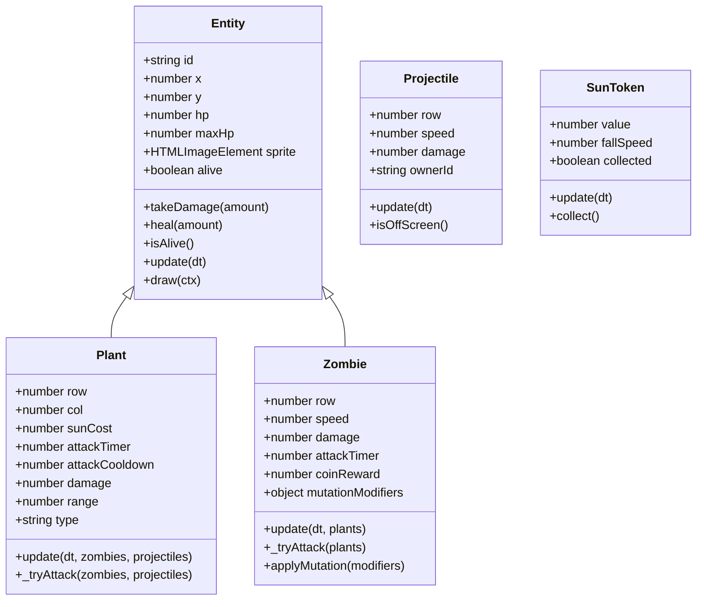
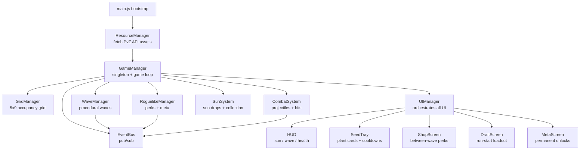
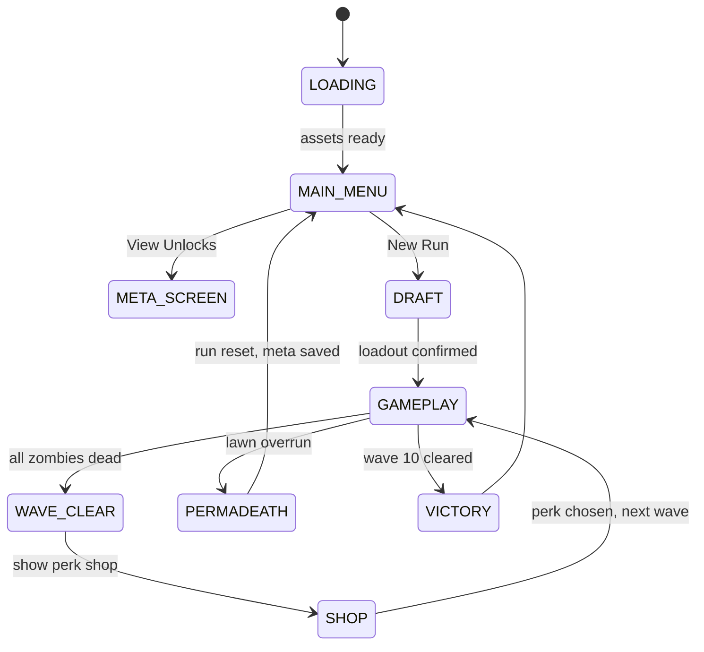

# Plants vs Zombies Roguelike — Architecture & Implementation Plan

## Overview

A fully functional Plants vs Zombies clone built in **vanilla JavaScript (ES Modules)** on an **HTML5 Canvas**, replacing the existing Warlords project. The game layers a **roguelike progression system** on top of classic PvZ tower-defense gameplay. All visual assets are fetched from the **PvZ Fan API** (`https://pvzapi.com`).

---

## Technology Stack

| Concern | Choice |
|---|---|
| Language | Vanilla JavaScript (ES Modules, no bundler) |
| Rendering | HTML5 Canvas 2D |
| Assets | PvZ Fan API — `https://pvzapi.com/api/plants`, `/api/zombies` |
| Persistence | `localStorage` (meta-currency, unlocks) |
| Server | `npx serve` (already configured) |
| Tests | Cypress (existing config preserved) |

---

## File Structure

```
index.html
src/
  main.js                        ← bootstrap
  core/
    constants.js                 ← GRID, CANVAS, GAME_STATE, EVENTS
    EventBus.js                  ← pub/sub singleton (reused)
    GameManager.js               ← singleton, game loop, state machine
    SaveManager.js               ← localStorage meta-currency + run save
  data/
    plants.json                  ← plant definitions (id, name, cost, cooldown, stats)
    zombies.json                 ← zombie definitions (id, name, hp, speed, damage)
    perks.json                   ← roguelike perk pool definitions
    waves.json                   ← wave templates (base compositions)
  entities/
    Entity.js                    ← base class (id, x, y, hp, maxHp, sprite)
    Plant.js                     ← extends Entity (row, col, attackTimer, sunCost)
    Zombie.js                    ← extends Entity (row, speed, damage, reward)
    Projectile.js                ← (x, y, row, speed, damage, owner)
    SunToken.js                  ← falling sun collectible
  systems/
    ResourceManager.js           ← fetch PvZ API, cache Image objects
    GridManager.js               ← 5×9 cell grid, occupancy, placement
    WaveManager.js               ← procedural wave gen, elite mutation, spawn queue
    RoguelikeManager.js          ← perk pool, draft, meta-currency, permadeath
    CombatSystem.js              ← projectile updates, hit detection, zombie attacks
    SunSystem.js                 ← sun generation (sunflowers + sky drops), collection
    AudioManager.js              ← Web Audio API stubs
  ui/
    UIManager.js                 ← orchestrates all DOM/canvas UI panels
    HUD.js                       ← top bar: sun, wave, health, active perks
    SeedTray.js                  ← bottom bar: plant cards, cooldown timers, drag
    ShopScreen.js                ← between-wave perk shop (3 random cards)
    DraftScreen.js               ← run-start plant loadout draft
    MetaScreen.js                ← permanent unlock tree
    MainMenuScreen.js            ← title screen
    EndScreen.js                 ← permadeath / victory summary
  styles/
    main.css                     ← layout, HUD, seed tray, shop, modals
```

---

## Class Hierarchy (OOP)



---

## System Architecture



---

## Game State Machine



---

## Roguelike Systems Detail

### 1. Plant Draft (Run Start)
- Full plant pool is loaded from `plants.json` + any meta-unlocked plants
- Player is shown **5 random plant cards** and must pick **3** to form their loadout
- Chosen plants populate the seed tray for the entire run

### 2. Between-Wave Perk Shop
- After each wave, game pauses and shows **3 randomly drawn perk cards** from `perks.json`
- Player spends **coins** (earned from killing zombies) to buy one perk
- Perks include: sun discount, plant damage boost, extra seed slot, zombie slow aura, etc.
- Remaining coins carry over; player can skip the shop

### 3. Procedural Wave Composition
- `WaveManager` uses `waves.json` base templates scaled by wave number
- Each wave randomly selects zombie types weighted by wave tier
- Every 3rd wave spawns an **elite zombie** with randomized mutation modifiers:
  - `speedMult` (1.5–2.5×), `hpMult` (2–4×), `damageMult` (1.5–3×), `armorType` (none/light/heavy)
- Wave 10 is the boss wave with a guaranteed giant elite zombie

### 4. Meta-Progression
- `SaveManager` persists `metaCurrency` (seeds) across runs
- `MetaScreen` shows a simple unlock tree: new plant types, starting sun bonus, extra seed slot
- Unlocks are permanent and available in all future runs

### 5. Permadeath
- If zombies reach the left edge of the grid (x = 0), the run ends immediately
- Run state is cleared; only meta-currency is preserved
- `EndScreen` shows wave reached, zombies killed, coins earned, perks collected

---

## PvZ API Asset Loading

The `ResourceManager` fetches from the public PvZ Fan API:

```
GET https://pvzapi.com/api/plants        → array of { name, image_url, ... }
GET https://pvzapi.com/api/zombies       → array of { name, image_url, ... }
```

Each `image_url` is loaded into an `HTMLImageElement` and cached by plant/zombie name. The `plants.json` and `zombies.json` data files map internal IDs to API names for lookup. Backgrounds are fetched from the API's environment/world endpoints or fallback to CSS gradients.

---

## Grid System

- **5 rows × 9 columns** logical grid
- Canvas grid starts at `x=220` (after seed tray), `y=120`, cell size `80×80px`
- `GridManager` maintains a `Map<"row,col", Plant>` occupancy map
- Click/drag on a seed card then click a cell to place; invalid cells (occupied, no sun) show red highlight
- Lawnmowers on each row (last-resort defense before permadeath)

---

## Canvas Layout

```
┌─────────────────────────────────────────────────────────────┐
│  HUD: [☀ 150] [Wave 3/10] [❤ ██████] [Perks: ⚡🌿]         │  ← 80px
├──────────────────────────────────────────────────────────────┤
│                                                              │
│  [LM]  GRID 9 cols × 5 rows  (720×400px)    [→ zombies]     │  ← 400px
│                                                              │
├──────────────────────────────────────────────────────────────┤
│  SEED TRAY: [🌻][🌱][💣][🧊][🌵]  cooldown overlays         │  ← 120px
└──────────────────────────────────────────────────────────────┘
  Canvas: 1280×720 logical px, CSS-scaled to viewport
```

---

## Data File Schemas

### `plants.json`
```json
{
  "plants": [
    {
      "id": "peashooter",
      "apiName": "Peashooter",
      "sunCost": 100,
      "hp": 300,
      "damage": 20,
      "attackCooldown": 1.5,
      "range": 9,
      "type": "shooter",
      "cooldown": 7.5,
      "description": "Shoots peas at zombies"
    }
  ]
}
```

### `zombies.json`
```json
{
  "zombies": [
    {
      "id": "basic",
      "apiName": "Zombie",
      "hp": 200,
      "speed": 30,
      "damage": 100,
      "attackCooldown": 1.0,
      "coinReward": 10,
      "tier": 1
    }
  ]
}
```

### `perks.json`
```json
{
  "perks": [
    {
      "id": "sun_discount",
      "name": "Bargain Botanist",
      "description": "All plants cost 25 less sun",
      "rarity": "common",
      "cost": 50,
      "effect": { "type": "sun_discount", "value": 25 }
    }
  ]
}
```

### `waves.json`
```json
{
  "waves": [
    {
      "wave": 1,
      "zombies": [
        { "id": "basic", "count": 3, "spawnInterval": 3.0 }
      ]
    }
  ]
}
```

---

## Key Implementation Rules

1. **Single Responsibility** — each class/file has one job; no class exceeds ~200 lines
2. **Encapsulation** — internal state uses `_prefixed` properties; public API is minimal
3. **No global state** outside `GameManager` singleton (accessed via `window.game` in dev only)
4. **EventBus** for all cross-system communication (no direct system-to-system calls)
5. **Modular methods** — aim for methods under 20 lines; extract helpers freely
6. **Descriptive naming** — `_tryAttackZombiesInRow()` not `_atk()`
7. **Data-driven** — all tunable values live in JSON, not hardcoded in classes

---

## Implementation Phases (Execution Order)

| Phase | Files | Description |
|---|---|---|
| 1 | `index.html`, `package.json`, `src/styles/main.css`, `src/main.js` | Project scaffold |
| 2 | `src/core/constants.js`, `EventBus.js`, `GameManager.js`, `SaveManager.js` | Core infrastructure |
| 3 | `src/data/plants.json`, `zombies.json`, `perks.json`, `waves.json` | Data layer |
| 4 | `src/systems/ResourceManager.js` | PvZ API asset fetching + caching |
| 5 | `src/entities/Entity.js`, `Plant.js`, `Zombie.js`, `Projectile.js`, `SunToken.js` | Entity OOP hierarchy |
| 6 | `src/systems/GridManager.js` | Grid occupancy + placement |
| 7 | `src/systems/WaveManager.js` | Procedural waves + elite mutations |
| 8 | `src/systems/RoguelikeManager.js` | Perks, draft, meta-currency |
| 9 | `src/systems/CombatSystem.js`, `SunSystem.js` | Combat + sun economy |
| 10 | `src/ui/UIManager.js`, `HUD.js`, `SeedTray.js` | Core HUD + seed tray |
| 11 | `src/ui/ShopScreen.js` | Between-wave perk shop |
| 12 | `src/ui/DraftScreen.js` | Plant draft screen |
| 13 | `src/ui/MetaScreen.js` | Meta-progression screen |
| 14 | `src/ui/MainMenuScreen.js`, `EndScreen.js` | Menu + end screens |
| 15 | Canvas rendering integrated into `GameManager._render()` | Full canvas draw pass |
