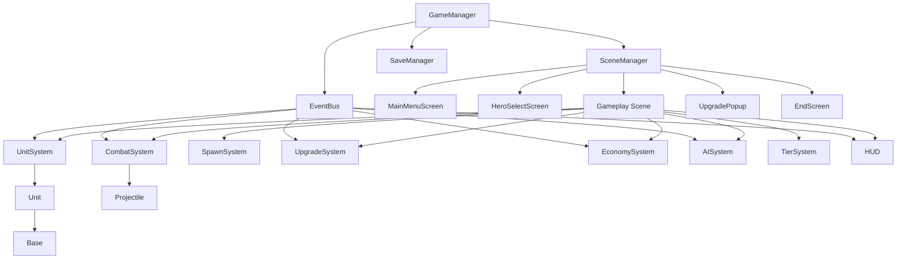
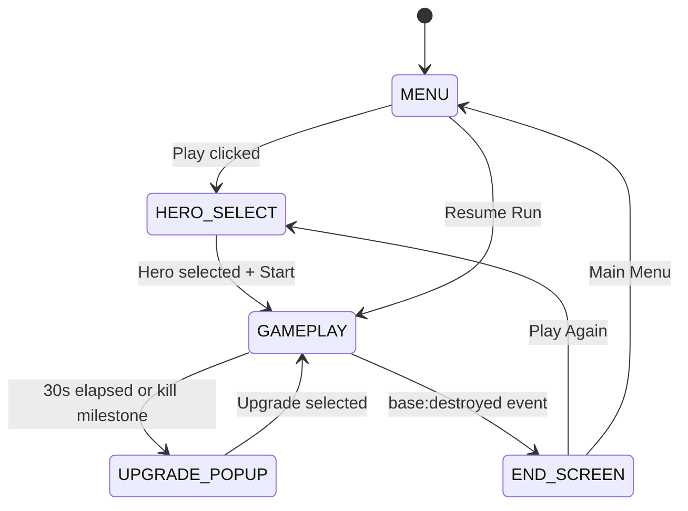
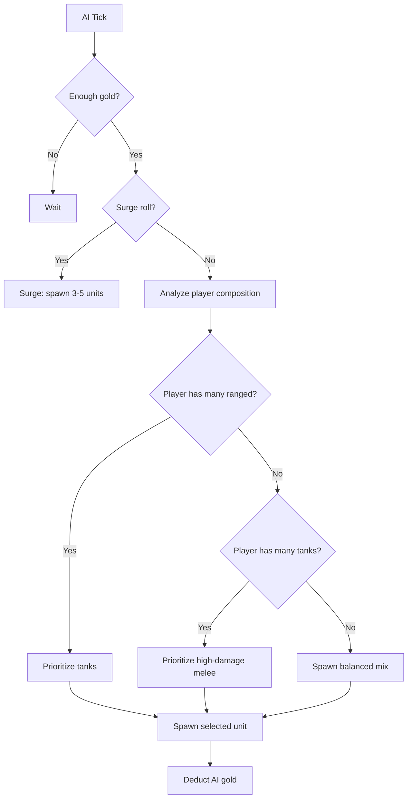

# Warlords: Last Siege — Full Implementation Plan

## Project Overview

**Type:** Browser-based 2D singleplayer lane-battler roguelike strategy  
**Stack:** HTML5, CSS3, JavaScript (OOP), Canvas / Phaser.js, Cypress  
**Team:** Marcell (UI/Art), Tomi (Gameplay/Balancing), Kevin (Architecture/AI)  
**Deployment:** GitHub Pages (static, no server required)

---

## System Architecture Overview



---

## Folder Structure

```
/src
  /core
    GameManager.js       — Central controller, game loop, state machine
    EventBus.js          — Global pub/sub singleton
    SceneManager.js      — Scene switching and lifecycle
    SaveManager.js       — localStorage persistence
  /entities
    Unit.js              — Base unit class
    Hero.js              — Hero base + DemonQueen, NecroKing, HumanCommander
    Base.js              — Player/enemy base structure
    Projectile.js        — Ranged attack projectile
  /systems
    UnitSystem.js        — Unit lifecycle, movement, lane queuing
    CombatSystem.js      — Attack logic, damage, range, status effects
    SpawnSystem.js       — Unit spawning, cooldowns, spawn queue
    UpgradeSystem.js     — Rarity weighting, upgrade pool, effect hooks
    EconomySystem.js     — Gold/XP passive income, kill rewards
    AISystem.js          — Enemy decision loop, counter-picking, surge
    TierSystem.js        — Tier unlock logic, XP costs, fanfare
  /ui
    UISystem.js          — Base UI controller
    HUD.js               — Gold, XP, HP bars, timer, spawn buttons
    UpgradePopup.js      — Upgrade selection overlay
    HeroSelectScreen.js  — Hero cards, difficulty selector
    MainMenuScreen.js    — Title, nav buttons, music
    EndScreen.js         — Win/lose banner, run summary
  /data
    units.json           — All unit stat definitions
    heroes.json          — Hero properties and starting bonuses
    upgrades.json        — All upgrade definitions with effects
    ai_profiles.json     — AI difficulty profiles
/assets
  /sprites               — Unit sprite sheets, base sprites, icons
  /icons                 — UI icons (gold, XP, unit buttons)
  /backgrounds           — Menu and gameplay backgrounds
  /audio
    /sfx                 — Sound effects
    /music               — Background music tracks
/tests
  /cypress
    hero_select.cy.js
    unit_spawn.cy.js
    economy.cy.js
    upgrade_select.cy.js
    win_lose.cy.js
    page_load.cy.js
/docs
  README.md
  architecture.md
  class_descriptions.md
  /wireframes
  /uml
index.html
package.json
.gitignore
cypress.config.js
.eslintrc.js
```

---

## Phase 1 — Project Scaffolding

### 1.1 Repository Initialization

**Files to create:**
- `index.html` — Entry point, loads canvas + UI containers, imports JS modules
- `package.json` — Dependencies: Phaser.js (or vanilla canvas), Cypress, ESLint
- `.gitignore` — node_modules, dist, .DS_Store, coverage
- `.eslintrc.js` — ESLint config enforcing OOP patterns, no globals
- `cypress.config.js` — Cypress base URL, spec pattern, viewport settings

**`index.html` structure:**
```html
<body>
  <div id="game-container">
    <canvas id="game-canvas"></canvas>
    <div id="ui-overlay"></div>
  </div>
</body>
```

### 1.2 Data Files Schema

#### `units.json` schema
```json
{
  "units": [
    {
      "id": "imp",
      "name": "Imp",
      "hero": "demonQueen",
      "tier": 1,
      "type": "melee",
      "hp": 100,
      "damage": 12,
      "speed": 60,
      "attackSpeed": 1.2,
      "range": 40,
      "cost": 55,
      "killXP": 1,
      "killGold": 16,
      "spriteKey": "imp_sheet",
      "animFrames": { "walk": 5, "attack": 4, "death": 3 }
    }
  ]
}
```

#### `heroes.json` schema
```json
{
  "heroes": [
    {
      "id": "demonQueen",
      "name": "Demon Queen",
      "playstyle": ["Swarm", "Aggression", "Cheap Units"],
      "passiveDescription": "Unit costs -15%. Spawning 3+ units in 5s triggers attack speed buff.",
      "startingGold": 120,
      "startingUnits": ["imp"],
      "tierUnlockCostModifier": 1.0,
      "uniqueUpgradePool": ["chain_explosion", "mass_spawn", "swarm_buff"],
      "portraitKey": "demonqueen_portrait"
    }
  ]
}
```

#### `upgrades.json` schema
```json
{
  "upgrades": [
    {
      "id": "melee_damage_boost",
      "name": "Bloodlust",
      "description": "All melee units gain +15% damage.",
      "rarity": "common",
      "weight": 50,
      "heroRestriction": null,
      "effectKey": "meleeDamageBoost",
      "effectValue": 0.15,
      "drawback": null
    }
  ]
}
```

#### `ai_profiles.json` schema
```json
{
  "profiles": [
    {
      "difficulty": "normal",
      "incomeMultiplier": 1.0,
      "decisionIntervalMin": 2,
      "decisionIntervalMax": 4,
      "tier2UnlockTime": 90,
      "tier3UnlockTime": 180,
      "surgeChance": 0.15,
      "surgeGoldThreshold": 200,
      "counterPickEnabled": true
    }
  ]
}
```

---

## Phase 2 — Core Systems

### 2.1 EventBus

```javascript
// Singleton pub/sub
class EventBus {
  constructor() { this._listeners = {}; }
  on(event, callback) { ... }
  off(event, callback) { ... }
  emit(event, data) { ... }
}
```

**All game events:**

| Event | Emitter | Listeners |
|-------|---------|-----------|
| `unit:spawned` | SpawnSystem | UnitSystem, HUD, AISystem |
| `unit:died` | CombatSystem | EconomySystem, UpgradeSystem, AISystem, HUD |
| `unit:moved` | UnitSystem | CombatSystem |
| `base:damaged` | CombatSystem | HUD, GameManager |
| `base:destroyed` | Base | GameManager |
| `upgrade:selected` | UpgradePopup | UpgradeSystem, SaveManager |
| `upgrade:triggered` | UpgradeSystem | GameManager |
| `tier:unlocked` | TierSystem | SpawnSystem, HUD, SaveManager |
| `gold:changed` | EconomySystem | HUD, SpawnSystem |
| `xp:changed` | EconomySystem | HUD, TierSystem |
| `run:won` | GameManager | SceneManager, SaveManager |
| `run:lost` | GameManager | SceneManager, SaveManager |
| `game:paused` | GameManager | All systems |
| `game:resumed` | GameManager | All systems |

### 2.2 GameManager State Machine



**GameManager methods:**
- `init()` — Load JSON data, initialize EventBus, SceneManager, SaveManager
- `startRun(heroId, difficulty)` — Initialize all systems with hero config, start game loop
- `pauseGame()` — Stop update tick, emit `game:paused`
- `resumeGame()` — Restart update tick, emit `game:resumed`
- `endRun(result)` — Collect run summary, transition to EndScreen
- `resetRun()` — Clear all system state, overwrite save

**Game loop (requestAnimationFrame):**
```
update(deltaTime):
  UnitSystem.update(dt)
  CombatSystem.update(dt)
  SpawnSystem.update(dt)
  EconomySystem.update(dt)
  AISystem.update(dt)
  UpgradeSystem.update(dt)
  TierSystem.update(dt)
  Renderer.render()
  HUD.update()
```

### 2.3 SceneManager

Manages DOM/canvas visibility for each screen. Each screen is a class with `show()`, `hide()`, `init(data)` methods. SceneManager holds references to all screen instances and calls the appropriate lifecycle methods on transition.

### 2.4 SaveManager

Serializes game state to `localStorage` under key `warlords_save`. Auto-saves every 30 seconds and on upgrade selection / tier unlock.

**Saved state shape:**
```json
{
  "heroId": "demonQueen",
  "difficulty": "normal",
  "gold": 340,
  "xp": 87,
  "currentTier": 2,
  "activeUpgrades": ["melee_damage_boost", "pierce_projectile"],
  "playerBaseHp": 800,
  "enemyBaseHp": 650,
  "runTimer": 142.5,
  "units": [
    { "id": "imp", "x": 420, "hp": 80, "owner": "player" }
  ]
}
```

---

## Phase 3 — Entity Classes

### 3.1 Unit (base class)

**Properties:** `id`, `name`, `tier`, `hp`, `maxHp`, `damage`, `speed`, `attackSpeed`, `cost`, `range`, `type`, `owner`, `position {x,y}`, `state` (idle/moving/attacking/dead), `statusEffects[]`, `appliedUpgrades[]`, `attackCooldown`

**Methods:**
- `move(dt)` — Advance position toward enemy base by `speed * dt`
- `attack(target)` — Deal damage to target, trigger attack animation, reset cooldown
- `takeDamage(amount)` — Reduce HP, apply status effects, check death
- `die()` — Set state=dead, play death animation, emit `unit:died`
- `applyStatusEffect(effect)` — Push to statusEffects[], apply modifier
- `canAttack()` — Returns true if attackCooldown <= 0
- `isInRange(target)` — Returns true if distance to target <= range

**Upgrade hooks (called by UpgradeSystem):**
- `onSpawn()` — Triggered when unit is created
- `onDeath()` — Triggered when unit dies
- `onKill(target)` — Triggered when this unit kills another
- `onAttack(target)` — Triggered on each attack

### 3.2 Hero (base class + subclasses)

**Base Hero properties:** `id`, `name`, `description`, `playstyle[]`, `passiveBonus`, `startingGold`, `startingUnits[]`, `tierUnlockCostModifier`, `uniqueUpgradePool[]`

**Subclasses:**

| Class | File | Key Override |
|-------|------|-------------|
| `DemonQueen` | `Hero.js` | `applyPassive()` — cost reduction, swarm speed buff |
| `NecroKing` | `Hero.js` | `applyPassive()` — death gold/XP, 5th-death revive |
| `HumanCommander` | `Hero.js` | `applyPassive()` — +20% gold income, ranged fire rate, tier bonus |

### 3.3 Base

**Properties:** `owner`, `hp`, `maxHp`, `position`  
**Methods:** `takeDamage(amount)` → emits `base:damaged`, `repair(amount)`, `isDestroyed()` → emits `base:destroyed`

### 3.4 Projectile

**Properties:** `owner`, `damage`, `speed`, `position {x,y}`, `target`, `piercing` (bool), `splitCount`, `homing` (bool), `splashRadius`  
**Methods:** `update(dt)` — move toward target, `onHit(target)` — apply damage, handle pierce/split/splash, `isExpired()` — off-screen or hit non-piercing

---

## Phase 4 — Game Systems

### 4.1 EconomySystem

- Passive gold tick: +5 gold every 3 seconds (modified by hero passive and upgrades)
- Passive XP tick: +3 XP every 5 seconds
- Kill rewards: gold = `unit.cost * 0.3`, XP = tier-based (T1=1, T2=2, T3=3)
- Emits `gold:changed` and `xp:changed` on every change
- Enforces gold cap (default 999, upgradeable)

### 4.2 TierSystem

- Tracks current tier (1, 2, or 3)
- Tier 2 unlock cost: 100 XP (modified by hero)
- Tier 3 unlock cost: 250 XP (modified by hero)
- `unlockTier(tier)` — deduct XP, emit `tier:unlocked`, trigger fanfare
- Human Commander bonus: grant gold on each tier unlock

### 4.3 SpawnSystem

- Maintains spawn queue per owner (player/enemy)
- `spawnUnit(unitId, owner)` — instantiate Unit from JSON data, apply active upgrades, place at base edge
- Enforces lane congestion: units queue behind frontmost friendly unit
- Tracks spawn cooldown per unit type (prevents instant re-spawn spam)
- Emits `unit:spawned`

### 4.4 CombatSystem

- Runs every frame: for each unit, check for enemies in range
- If target found: call `unit.attack(target)`, create Projectile if ranged
- Projectile update loop: move projectiles, check collisions
- Damage application: `target.takeDamage(damage * modifiers)`
- Status effect processing: burn, slow, etc. applied per tick
- Base attack: if unit reaches enemy base with no blockers, attacks base directly

### 4.5 UnitSystem

- Maintains `playerUnits[]` and `enemyUnits[]` arrays
- `update(dt)` — for each living unit: call `move(dt)` if not in combat, call `attack()` if in range
- Lane queuing: units stop if a friendly unit is directly ahead within buffer distance
- Removes dead units from arrays, triggers cleanup

### 4.6 UpgradeSystem

**Upgrade trigger logic:**
- Timer-based: every 30 seconds
- Kill milestone: every 10 enemy kills (whichever comes first)
- Pauses game, shows UpgradePopup with 3 randomly weighted offers

**Rarity weight table (base):**

| Rarity | Base Weight | Late-game Weight |
|--------|-------------|-----------------|
| Common | 50 | 35 |
| Rare | 30 | 35 |
| Epic | 15 | 20 |
| Legendary | 4 | 8 |
| Cursed | 1 | 2 |

**Effect application:** Each upgrade has an `effectKey` that maps to a function in `UpgradeEffects.js`. Effects modify unit stats via multipliers stored on the UnitSystem or directly on unit instances via `appliedUpgrades[]`.

**Effect hook registry (examples):**
```javascript
UpgradeEffects = {
  meleeDamageBoost: (value) => UnitSystem.applyGlobalModifier('melee', 'damage', 1 + value),
  pierceProjectile: () => ProjectileSystem.setPiercing(true),
  deathExplosion: () => EventBus.on('unit:died', handleExplosion),
  ...
}
```

### 4.7 AISystem

**Decision loop (runs every 2–4 seconds based on difficulty):**



**AI economy:** Runs parallel to player economy with `incomeMultiplier` from `ai_profiles.json`. AI has its own gold/XP counters. AI unlocks tiers at fixed time thresholds.

**Counter-picking logic:**
- Count player unit types in `playerUnits[]`
- If `rangedCount > meleeCount + tankCount`: spawn tank
- If `tankCount > rangedCount`: spawn high-damage melee
- Otherwise: spawn proportional mix

---

## Phase 5 — UI Implementation

### 5.1 HUD Layout

```
┌─────────────────────────────────────────────────────────────┐
│  [BASE HP ████████░░]    [TIMER: 02:34]    [ENEMY HP ████░░] │
│  💰 340    ⭐ 87/100 [T2]                                    │
├─────────────────────────────────────────────────────────────┤
│                    CANVAS (game lane)                        │
│                                                              │
├─────────────────────────────────────────────────────────────┤
│ [IMP 55g] [HELLBAT 70g] [BRUTE 80g] | [SUCCUBUS 130g] ...  │
└─────────────────────────────────────────────────────────────┘
```

### 5.2 Hero Select Screen Layout

```
┌─────────────────────────────────────────────────────────────┐
│              SELECT YOUR COMMANDER                           │
│                                                              │
│  ┌──────────┐  ┌──────────┐  ┌──────────┐                  │
│  │ DEMON    │  │ NECRO    │  │ HUMAN    │                  │
│  │ QUEEN    │  │ KING     │  │ COMMANDER│                  │
│  │[portrait]│  │[portrait]│  │[portrait]│                  │
│  │Swarm     │  │Death Syn │  │Balanced  │                  │
│  │Aggression│  │Revive    │  │Economy   │                  │
│  └──────────┘  └──────────┘  └──────────┘                  │
│                                                              │
│  Difficulty: [EASY] [NORMAL] [HARD]                         │
│                                                              │
│                    [START RUN]                               │
└─────────────────────────────────────────────────────────────┘
```

### 5.3 Upgrade Popup Layout

```
┌─────────────────────────────────────────────────────────────┐
│                  ✨ CHOOSE AN UPGRADE ✨                     │
│                                                              │
│  ┌──────────┐  ┌──────────┐  ┌──────────┐                  │
│  │ [WHITE]  │  │ [BLUE]   │  │ [PURPLE] │                  │
│  │ COMMON   │  │ RARE     │  │ EPIC     │                  │
│  │Bloodlust │  │Piercing  │  │Elite     │                  │
│  │+15% melee│  │Shots     │  │Spawn     │                  │
│  │damage    │  │Projectile│  │Every 5th │                  │
│  │          │  │pierce +1 │  │unit elite│                  │
│  └──────────┘  └──────────┘  └──────────┘                  │
└─────────────────────────────────────────────────────────────┘
```

---

## Phase 6 — Canvas Rendering

### Rendering Pipeline

```
render():
  ctx.clearRect(0, 0, canvas.width, canvas.height)
  drawBackground()
  drawBases()
  drawUnits()          // sorted by x position
  drawProjectiles()
  drawHealthBars()     // above each unit
  drawStatusEffects()  // icons above units
```

### Coordinate System

- Canvas width: 1280px (logical), height: 720px (logical)
- Player base: x=80, centered vertically
- Enemy base: x=1200, centered vertically
- Lane y-center: canvas.height / 2
- Units rendered at their `position.x`, `laneY - spriteHeight/2`

### Sprite Animation System

Each unit has a sprite sheet with rows for each animation state:
- Row 0: Walk (5 frames)
- Row 1: Attack (4 frames)
- Row 2: Death (3 frames)

`AnimationController` class tracks current frame, state, and elapsed time per unit. Frame advances based on `animSpeed` property.

### Responsive Scaling

```javascript
function resizeCanvas() {
  const scaleX = window.innerWidth / LOGICAL_WIDTH;
  const scaleY = window.innerHeight / LOGICAL_HEIGHT;
  const scale = Math.min(scaleX, scaleY);
  canvas.style.width = LOGICAL_WIDTH * scale + 'px';
  canvas.style.height = LOGICAL_HEIGHT * scale + 'px';
}
window.addEventListener('resize', resizeCanvas);
```

---

## Phase 7 — Audio System

### Audio Manager

```javascript
class AudioManager {
  constructor() {
    this.context = new AudioContext();
    this.sfxGain = this.context.createGain();
    this.musicGain = this.context.createGain();
    this.sfxVolume = 0.8;
    this.musicVolume = 0.5;
  }
  playSFX(key) { ... }
  playMusic(key, loop = true) { ... }
  stopMusic() { ... }
  setSFXVolume(v) { ... }
  setMusicVolume(v) { ... }
}
```

### Required Audio Assets

**SFX (minimum):**
- `spawn_demon.wav`, `spawn_undead.wav`, `spawn_human.wav`
- `melee_hit.wav`, `ranged_fire.wav`, `projectile_impact.wav`
- `unit_death.wav`, `base_hit.wav`, `base_destroyed.wav`
- `upgrade_open.wav`, `upgrade_select.wav`
- `tier_unlock.wav`, `btn_click.wav`, `btn_hover.wav`
- `victory.wav`, `defeat.wav`

**Music:**
- `menu_theme.mp3` (looping, atmospheric)
- `gameplay_theme.mp3` (looping, energetic)
- `victory_theme.mp3` (short, triumphant)
- `defeat_theme.mp3` (short, somber)

---

## Phase 8 — Testing (Cypress)

### Test Architecture

All tests use `data-cy` attributes on DOM elements for reliable selection. The game exposes a `window.GameTestAPI` object in non-production mode for direct state inspection.

```javascript
// GameManager exposes test API
window.GameTestAPI = {
  getGold: () => EconomySystem.gold,
  getXP: () => EconomySystem.xp,
  getPlayerBaseHP: () => playerBase.hp,
  getEnemyBaseHP: () => enemyBase.hp,
  getActiveUpgrades: () => UpgradeSystem.activeUpgrades,
  getCurrentTier: () => TierSystem.currentTier,
  getUnitsOnLane: () => UnitSystem.playerUnits.length,
  triggerUpgradePopup: () => UpgradeSystem.forcePopup(),
  setEnemyBaseHP: (hp) => enemyBase.hp = hp,
  setPlayerBaseHP: (hp) => playerBase.hp = hp,
};
```

### Test Cases Summary

| File | Key Assertions |
|------|---------------|
| `page_load.cy.js` | Title visible, Play button present, no console errors |
| `hero_select.cy.js` | 3 cards shown, selection highlights, start disabled until selection |
| `unit_spawn.cy.js` | Gold deducted on spawn, unit appears, disabled when broke |
| `economy.cy.js` | Gold increases over time, XP increases, tier deducts XP |
| `upgrade_select.cy.js` | Popup at 30s, 3 cards shown, selection closes popup |
| `win_lose.cy.js` | Enemy HP=0 → win screen, Player HP=0 → lose screen |

---

## Phase 9 — Documentation

### README.md Sections
1. Project title + tagline
2. Team members and roles
3. Tech stack
4. How to run locally
5. How to run Cypress tests
6. GitHub Pages live link
7. Screenshots (5 screens)
8. Demo video link
9. Feature list

### architecture.md Sections
1. System overview diagram
2. Class descriptions (all 20+ classes)
3. EventBus pattern + full event catalog
4. Data-driven design (JSON schemas)
5. Save/load system description
6. Upgrade effect hook system

### UML Diagrams (draw.io → /docs/uml/)
- `class_diagram.drawio` — All classes, properties, methods, relationships
- `sequence_upgrade.drawio` — Upgrade selection flow
- `sequence_combat.drawio` — Unit spawn and combat flow

### Wireframes (draw.io → /docs/wireframes/)
- `main_menu.drawio`
- `hero_select.drawio`
- `gameplay.drawio`
- `upgrade_popup.drawio`
- `end_screen.drawio`

---

## Phase 10 — CI/CD & Deployment

### GitHub Actions Workflow (`.github/workflows/cypress.yml`)

```yaml
name: Cypress Tests
on: [pull_request]
jobs:
  cypress-run:
    runs-on: ubuntu-latest
    steps:
      - uses: actions/checkout@v3
      - uses: actions/setup-node@v3
      - run: npm install
      - run: npx cypress run
```

### GitHub Pages Deployment
- Enable GitHub Pages on `main` branch root
- No build step required (pure static files)
- URL: `https://<org>.github.io/warlords-last-siege/`

---

## Team Responsibility Matrix

| Task | Kevin | Tomi | Marcell |
|------|-------|------|---------|
| Repo init, folder structure | ✅ | | |
| GameManager, EventBus, SceneManager, SaveManager | ✅ | | |
| UpgradeSystem | ✅ | | |
| AISystem | ✅ | | |
| README.md, architecture.md | ✅ | | |
| GitHub Actions CI | ✅ | | |
| units.json, heroes.json, upgrades.json, ai_profiles.json | | ✅ | |
| TierSystem, EconomySystem | | ✅ | |
| CombatSystem (damage calc, range) | | ✅ | |
| Balance testing, patch notes | | ✅ | |
| All sprite assets | | | ✅ |
| All audio assets | | | ✅ |
| UISystem, HUD, all screens | | | ✅ |
| Unit + Projectile rendering | | | ✅ |
| Animations, responsive scaling | | | ✅ |
| Cypress tests | ✅ | ✅ | ✅ |
| UML diagrams | ✅ | | |
| Wireframes | | | ✅ |

---

## Milestone Checklist

### Week 1 — Playable Prototype
- [ ] Repo initialized with full folder structure
- [ ] GameManager running basic game loop
- [ ] Lane rendered on canvas with both bases
- [ ] Tier 1 units for one hero spawnable and functional
- [ ] Units move, attack, die correctly
- [ ] Basic gold + XP economy working
- [ ] Win/lose states trigger correctly
- [ ] Simple AI spawning Tier 1 units
- [ ] All core classes implemented (Unit, Base, Hero, Projectile)

### Week 2 — Feature-Complete Alpha
- [ ] All 3 heroes with unique passives and unit rosters
- [ ] All 3 tiers unlockable via XP
- [ ] Full roguelike upgrade system with all upgrades
- [ ] Upgrade popup triggering and applying effects
- [ ] AI with all 3 difficulty levels
- [ ] Hero select screen functional
- [ ] HUD fully functional
- [ ] Save/load system working
- [ ] All unit types (melee, ranged, tank) for all heroes
- [ ] Projectile system for ranged units
- [ ] Cypress test suite written and passing

### Week 3 — Final Version
- [ ] All sprite assets finalized (no placeholders)
- [ ] All audio assets integrated with volume controls
- [ ] Full UI polish (animations, transitions)
- [ ] Comprehensive balance pass
- [ ] All Cypress tests passing
- [ ] README.md complete
- [ ] architecture.md complete
- [ ] UML diagrams exported to /docs/uml
- [ ] Wireframes exported to /docs/wireframes
- [ ] Demo video recorded and linked
- [ ] Deployed to GitHub Pages
- [ ] Final PR from dev to main reviewed and merged
